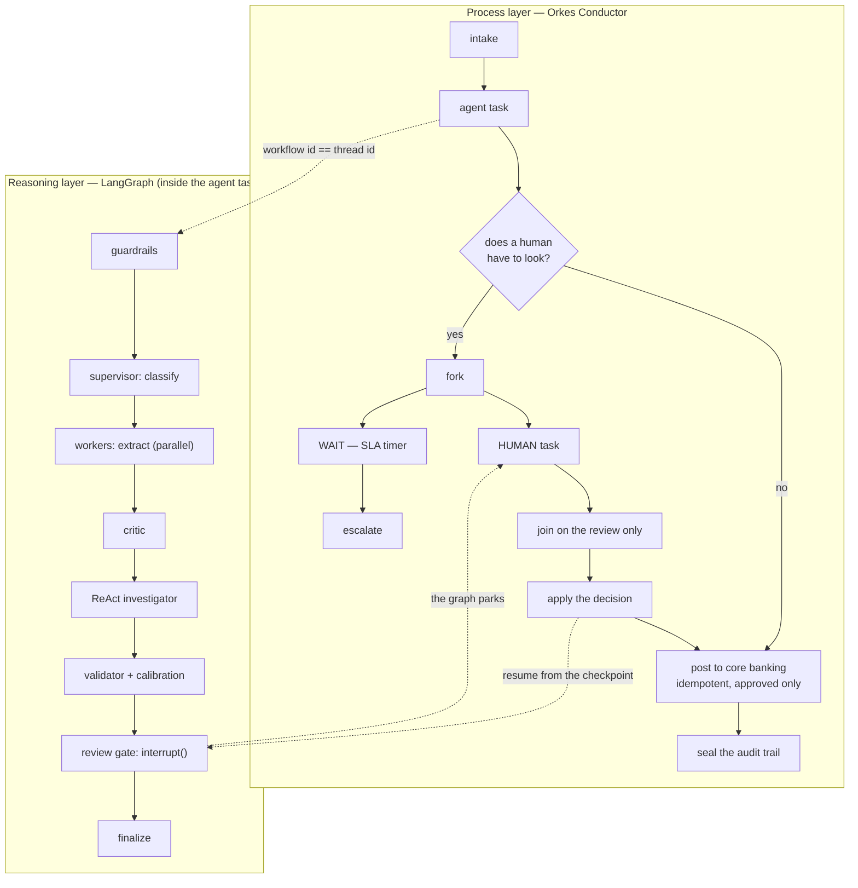

<div align="center">

# Wathiq · واثق

**Assurance-first intelligent document processing for banking operations.**

Agentic AI reads corporate KYC documents, extracts and cross-checks the fields, and sends only the
doubtful cases to a human — with every step evidenced and audited.

`LangGraph` · `Orkes Conductor` · `Azure AI Foundry` · `MCP` · `FastAPI` · `React` · `PostgreSQL + pgvector`

</div>

> **Status:** milestone M1 (foundation) complete — the whole system runs, all ten screens are live
> against the real API with 30 seeded synthetic cases. The agent pipeline is connected in M2.
> Progress: [docs/PROGRESS.md](docs/PROGRESS.md).

---

## Quick start

You need **Docker Desktop** and **Git**. Nothing else — no Python, no Node.

```bash
git clone https://github.com/leopbar/wathiq.git
cd wathiq
docker compose up --build
```

Then open **http://localhost:5173** and click any role on the sign-in screen.

| What | Where |
|---|---|
| Web console | http://localhost:5173 |
| API docs (OpenAPI) | http://localhost:8000/docs |
| Health check | http://localhost:8000/healthz |

**Demo sign-in (demo mode only).** One click per role, no password needed. If you prefer to type
one, every demo account uses `Wathiq!Demo2026`.

| Role | Email | Sees |
|---|---|---|
| Operations Officer | `layla.almansoori@wathiq.demo` | Create cases, upload, track progress |
| Reviewer | `omar.haddad@wathiq.demo` | The review queue |
| Supervisor | `noura.alzaabi@wathiq.demo` | Escalations, SLA breaches, team dashboards |
| Admin | `rashid.belhoul@wathiq.demo` | Document types, prompts, rules, users, integrations |
| Auditor | `fatima.darwish@wathiq.demo` | Read-only cases and the full audit trail |

These accounts exist **only** when `WATHIQ_MODE=demo`. In Azure mode the endpoint returns 404 and
sign-in goes through Microsoft Entra ID.

---

## What it does

1. **Upload** — an officer creates a case and drops in a trade licence, Emirates IDs, passports and a
   memorandum of association, in Arabic or English.
2. **Classify** — a supervisor agent decides what each document is.
3. **Extract** — worker agents pull out the fields **in parallel**, each value carrying the snippet it
   came from and a confidence score.
4. **Challenge** — a critic agent argues with the extractor; a ReAct investigator uses MCP tools to
   resolve disagreements between documents.
5. **Validate** — versioned cross-field rules check values against each other and against policy.
6. **Decide** — confident cases go straight through; doubtful ones stop at a review gate and wait for
   a human, with the reason named.
7. **Post and audit** — approved records are posted once (idempotently) to the core banking system,
   and every step is appended to an audit log: who, what, when, which prompt version, which model.

A second use case — **salary certificates** — is onboarded through configuration only (schema,
prompt, rules, golden set) to prove the engine does not change when a document type is added.

---

## Architecture in one picture



**Two layers, one identifier.** Conductor runs the business process and can wait days for a person.
LangGraph runs the AI reasoning inside a single Conductor task. The Conductor workflow ID is the
LangGraph thread ID, so one number links the process, the reasoning and the audit trail.

Two details worth noticing in the diagram: the SLA timer runs **beside** the human review rather than
after it, so a review that is late is noticed while it is still open; and exactly one step writes
anything outside Wathiq, with an approval and an idempotency key.

Full set of diagrams: [docs/ARCHITECTURE.md](docs/ARCHITECTURE.md) — and the same diagrams render
live inside the app on the **About the system** screen.

---

## Screens

| # | Screen | What it shows |
|---|---|---|
| 1 | Login | One-click demo sign-in per role |
| 2 | Dashboard | Straight-through rate, review rate, handling time, SLA breaches, cost per case |
| 3 | New case | Drag-and-drop upload and a live pipeline stepper |
| 4 | Case detail | Document viewer with highlighted source regions, fields with confidence, findings with policy citations, full agent timeline |
| 5 | Review workspace | Queue with SLA timers; document and fields side by side; approve / correct / reject with reason codes and keyboard shortcuts |
| 6 | Quality Lab | Five test bands, regression history, calibration curve |
| 7 | Prompt Studio | Semantic versions, diffs, evaluation scores, approve / retire |
| 8 | Settings | Document types, users, integration status (Connected / Simulated / Demo) |
| 9 | Audit log | Searchable append-only trail with CSV export |
| 10 | About the system | Live architecture diagrams and the stack with reasons |

*Screenshots are added in M7.*

---

## Two modes, switched by configuration only

| | DEMO (default) | AZURE |
|---|---|---|
| Model | Deterministic FakeModel — works offline | Azure AI Foundry deployment |
| OCR | Built-in demo OCR | Azure AI Document Intelligence |
| Safety | Local heuristic prompt shield | Azure AI Content Safety + Prompt Shields |
| Retrieval | pgvector | Azure AI Search |
| Storage | Local folder | ADLS Gen2 |
| Sign-in | Local accounts + JWT | Microsoft Entra ID (OIDC) |
| Telemetry | Console + per-case timeline | Azure Monitor (OpenTelemetry) |

Switch with `WATHIQ_MODE=azure` and the keys in `.env` (see `.env.example`). The role model, the
screens and the API are identical in both.

### Honesty about what is simulated
`Simulated` is shown in the UI, the API and here. These are real services with real contracts that
talk to **synthetic data** — no external system is contacted:

- **Core banking** posting API (idempotent, returns reference numbers)
- **Company registry** lookup
- **Sanctions screening** (a small list of invented names — not a real sanctions source)

Each of the three is a real MCP server in its own container, speaking the Model Context Protocol
over streamable HTTP. A fourth, the **document store**, is not simulated: it serves the real
uploaded files, with the storage volume mounted read-only and no tool that writes.

Least privilege is enforced twice: the servers are separate processes, and each node of the agent
graph carries an allowlist of the tool names it may call. Core banking is the only server that can
write anything, and only the posting step may call it. The Settings screen shows that table,
generated from the running code.

All people, companies and identifiers in this repository are invented. The policy documents the
findings cite are synthetic too, written for this demonstration.

---

## The stack, and why

| Layer | Choice | Why this, not that |
|---|---|---|
| Reasoning | **LangGraph** | Explicit graph with checkpointed state, so a case can pause for a human and resume exactly where it stopped. CrewAI hides the state machine; plain Python has no checkpointing. |
| Process | **Orkes Conductor** | First-class HUMAN and WAIT tasks with SLA timers and retries. Airflow is batch-oriented; Temporal is strong but Conductor is the target stack. |
| Tools | **MCP servers** | Each tool is a separate server with its own permissions, so a node gets only what it needs and new document types reuse them. |
| Backend | **FastAPI + Pydantic v2** | Async for live progress; one Pydantic model validates both API input and model output, so schemas cannot drift. Django adds weight we do not use. |
| Database | **PostgreSQL 16 + pgvector** | One database for records, LangGraph checkpoints and embeddings. A separate vector database adds a service and a cost for no benefit at this scale. |
| Live progress | **Server-Sent Events** | Progress only flows server → client; SSE is one HTTP response that reconnects itself. WebSockets would add two-way plumbing we do not need. |
| Frontend | **React + TypeScript + Vite** | An internal console behind a login: no SEO, no server rendering. Next.js would add a Node server to run and secure. |
| UI | **Tailwind v4 + Radix (shadcn style)** | A small design system we own, accessible by construction. Material UI is hard to make look bespoke. |
| Platform | **Docker Compose → AKS + Helm + Bicep** | One command locally; the same images on the team's production platform. Bicep is first-party Azure IaC with no state file to manage. |

Longer reasoning, including the alternatives rejected: [docs/DECISIONS.md](docs/DECISIONS.md).

---

## Job-skills coverage

Every item below is demonstrable in the running system; the checklist lives in
[docs/PROGRESS.md](docs/PROGRESS.md).

- **LangGraph patterns** — supervisor-worker with the Send API, self-reflection, actor-critic, ReAct,
  HITL `interrupt()`, TypedDict state, conditional edges
- **Extraction** — structured outputs, Pydantic validation, per-field confidence and calibration
- **Prompt management** — semantic versioning, draft/approved/retired, diffs, correctness *and*
  sensitivity testing
- **MCP** — four servers, extended for the second use case, least-privilege tool sets
- **Testing** — five bands (model, prompt, agent, AI security, adversarial), golden and regression
  datasets, CI gate on regressions
- **Process orchestration** — an Orkes Conductor workflow with HUMAN and WAIT tasks, a fork/join SLA
  timer, Python task workers, idempotent posting and crash recovery by redelivery
- **HITL** — mandatory and dynamic interrupt points, Conductor wait tasks, checkpoint persistence and
  resumption, crash recovery
- **AI security** — prompt shielding, PII tokenisation, output sanitisation, Content Safety
- **Validation** — versioned cross-field rules
- **Azure** — AI Foundry, Document Intelligence, AI Search, ADLS Gen2, Azure ML, Azure Monitor, AKS
- **Engineering** — Pydantic, FastAPI, TypeScript, REST, JSON schema, Git, CI/CD, failure-mode
  analysis

---

## Development

Everything runs in containers; nothing is installed on your machine.

```bash
docker compose up --build                     # start the whole system (hot reload)
docker compose logs -f api                    # follow the backend
docker compose --profile process up -d        # add Orkes Conductor + its workers (~2 GB more RAM)
docker compose logs -f worker                 # follow the Conductor task workers
```

**With or without Conductor.** The business process is declared once and can be run by two engines:
Orkes Conductor, or an in-process engine inside the API container. With the `process` profile off,
the same workflow runs on the fallback — the same steps, from the same code, writing the same audit
trail. The Settings → Process screen always says which of the two actually ran, and every case
records it, so a demo on the fallback can never be mistaken for one on Conductor.

Conductor's own UI is at <http://localhost:5000> when the profile is on.

Tests and checks:

```bash
docker compose run --rm -e WATHIQ_DATABASE_URL=postgresql+psycopg://wathiq:wathiq@db:5432/wathiq_test --entrypoint pytest api -q
```

```bash
docker compose run --rm --no-deps --entrypoint ruff api check .
```

```bash
docker compose --profile test run --rm e2e
```

The MCP tool servers have their own suite. It drives each server in-process through the official
MCP client, so nothing has to be listening for it to run:

```bash
docker compose --profile test run --rm mcp-tests
```

Production-shaped stack (built images, nginx, no hot reload):

```bash
docker compose -f compose.yaml -f compose.prod.yaml up --build -d
```

CI runs all of the above in containers on every push and pull request, plus a gitleaks secret scan.

---

## Documentation

| Document | What it is for |
|---|---|
| [docs/SYSTEM_OVERVIEW.md](docs/SYSTEM_OVERVIEW.md) | The problem, the solution, the users — one page |
| [docs/ARCHITECTURE.md](docs/ARCHITECTURE.md) | Five diagrams with explanations |
| [docs/DECISIONS.md](docs/DECISIONS.md) | Why this, not that |
| [docs/GLOSSARY.md](docs/GLOSSARY.md) | Every term in one sentence, with an everyday analogy |
| [docs/API.md](docs/API.md) | The API contract |
| [docs/DESIGN.md](docs/DESIGN.md) | The design system |
| [docs/PLAN.md](docs/PLAN.md) · [docs/PROGRESS.md](docs/PROGRESS.md) | Milestones and status |

---

## Security and data

- Secrets live only in `.env` (git-ignored) or Key Vault — never in code, never in the repository.
- Containers run as non-root users with healthchecks.
- All data is synthetic: invented people, invented companies, invented identifiers, no bank names or
  logos.
- `gitleaks` runs in CI and before every commit.

## Licence

Built as a portfolio project. Synthetic data only.
