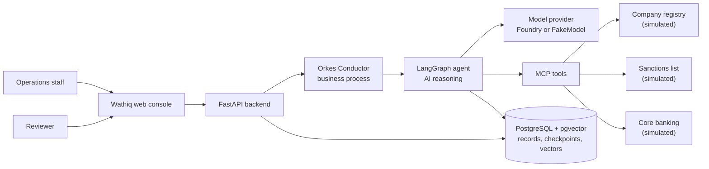
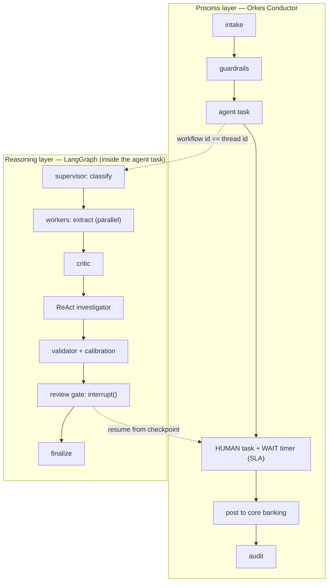
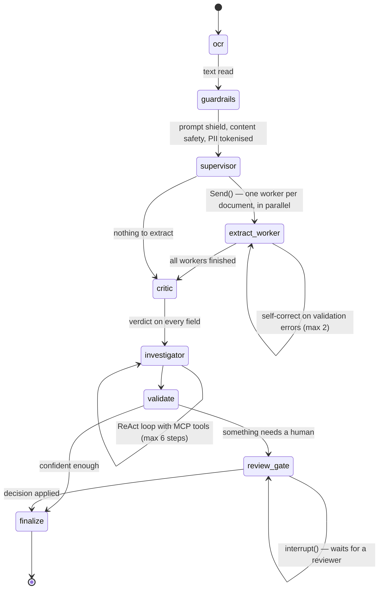
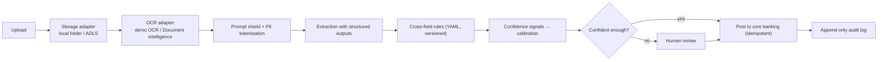
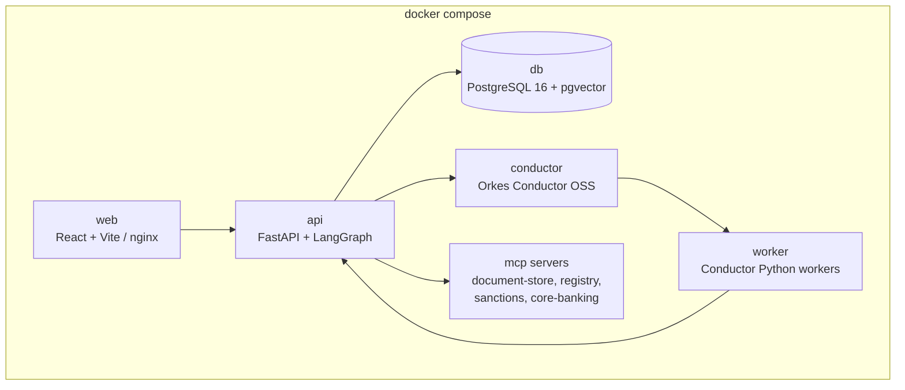

# Architecture

Five pictures, each with a short explanation. The same diagrams are rendered live inside the app on
the **About the system** screen (they come from `GET /api/v1/system/info`).

---

## 1. System at a glance

People only ever talk to the web console. The backend owns the data and starts the process; the
process layer decides *what happens next*; the reasoning layer decides *what the documents say*.
Tools that reach outside the system are MCP servers, so each one has its own contract and its own
permissions.

---

## 2. The two layers

**This is the diagram to start from when explaining the system.**

- Conductor is the *manager*: it knows the order of business steps, how long each may take, who must
  act, and what to do when nobody does (escalate).
- LangGraph is the *thinker*: given the documents, it works out what they say and how sure it is.
- They meet at one identifier. `case.thread_id` is both the Conductor workflow ID and the LangGraph
  thread ID, so a single search finds the business history *and* the reasoning history.

---

## 3. The agent graph

This is the graph that runs. The About screen in the running app draws it from the compiled
graph object, so the picture cannot drift from the code.

| Node | Pattern | What it does |
|---|---|---|
| `ocr` | — | Reads the text out of each stored document. Demo mode reads the PDF text layer; an image gets an honest "cannot read this" rather than invented text. |
| `guardrails` | AI security | Prompt shield, content safety and PII tokenisation, **before** anything reads the text as meaningful. Produces two copies: the cleaned text the pipeline reads, and a tokenised copy that is the only form allowed into a log. |
| `supervisor` | supervisor-worker | Classifies each document, records the evidence for the choice, and fans work out with the Send API — one worker per document, running in the same superstep. |
| `extract_worker` | self-reflection | Extracts the schema's fields, validates against a Pydantic model built from that schema, and repairs what fails: at most two passes, each recorded with what it tried and why. |
| `critic` | actor-critic | An independent second read of every value: is it on the page, is it the right shape, is it under its own label. Where the document-store MCP server is reachable it asks the file, not the state. |
| `investigator` | ReAct | Thought → action → observation, with MCP tools, for what the documents cannot answer: screening every named party, and settling a name that differs between two documents. At most six steps. |
| `validate` | rules | Versioned YAML rule packs, policy quotes retrieved from the index, then calibration turns each raw score into a probability. |
| `review_gate` | HITL | Calls `interrupt()`. The graph stops here and the state is checkpointed; it can wait hours. |
| `finalize` | — | Closes the case out. Posting to core banking is wired in M4. |

Two branches, and they are the two decisions the system makes: `fan_out` after the supervisor
(how many workers), and `needs_human` after validate (person or not). If nothing needs a person
the case goes straight to `finalize` — that is the "straight-through" number on the dashboard.

**The rule that matters:** a node that can interrupt must have no side effects above the
`interrupt()` call, because the node re-runs from its first line when the graph resumes. The
review-task rows are therefore created by the runner, outside the graph, which runs once per
pause. See DECISIONS #29.

### Why the state uses the reducers it does

Parallel workers write to the state in the same superstep. A key whose reducer keeps the last
write would lose all but one of them, so `findings`, `tool_calls`, `guardrails`, `critic_notes`
and `investigation` all append. `fields` uses a merge-by-(document, name) reducer instead: the
workers write disjoint fields, and the critic later writes revised copies of fields it has
challenged, which must **replace** rather than duplicate.

### When a human is asked

| Point | Kind | Raised by |
|---|---|---|
| Possible sanctions match | mandatory | investigator |
| Required document expired | mandatory | rule pack (critical severity) |
| First cases of a new document type | mandatory | supervisor (unclassified document) |
| Content safety flagged the upload | mandatory | guardrails |
| Registry says the company is not trading | mandatory | investigator |
| Low calibrated confidence on a critical field | dynamic | validate |
| The critic disagreed about a critical field | dynamic | critic |
| Suspected instructions hidden in a document | dynamic | guardrails |
| Values disagree across documents | dynamic | rule pack / investigator |
| Not every external check could be completed | dynamic | investigator |

---

### Tools and least privilege

Four MCP servers, each its own process and its own container:

| Server | Can write? | Tools | Which node may call it |
|---|---|---|---|
| document-store | no (volume mounted read-only) | `read_document`, `find_in_document`, `list_case_documents` | critic, investigator |
| company-registry (simulated) | no | `lookup_by_license`, `search_by_name`, `reconcile_names` | investigator |
| sanctions (simulated sample list) | no | `screen_name`, `describe_list` | investigator |
| core-banking (simulated) | **yes** | `get_customer`, `post_kyc_refresh`, `get_posting` | post (M4) only |

Two independent locks on the only server that can write: the investigator is never given its
address, and the broker in the API refuses the call by name even if it were. The Settings screen
shows this table from the running code.

---

## 4. What happens to a document

Confidence is not the model's self-reported number alone. Each field's score is a weighted average
of five signals, and every one of them is a fact about how the value was obtained:

| Signal | Question it answers | Weight |
|---|---|---|
| `ocr` | How well was the page read at all? | 0.20 |
| `grounded` | Does this exact value appear in the document text? | 0.25 |
| `label` | Was it found next to its own label, or guessed from nearby text? | 0.15 |
| `shape` | Does it look like what the schema asks for (date, number, list)? | 0.20 |
| `critic` | Did the independent second read agree? | 0.20 |

That weighted average is the **raw** score. It is then mapped through a **calibration** curve —
Platt scaling, two parameters — fitted on what reviewers actually decided: a field they accepted
was read correctly, a field they corrected was not. The result is the **calibrated** score, and it
is the one the thresholds read, because it is the one that means "right about this often".

Until enough reviewers have decided enough cases, the curve is not fitted and the product shows
raw scores **labelled as raw**. An uncalibrated number dressed up as a calibrated one is the kind
of dishonesty this whole system exists to avoid.

---

## 4b. Policy retrieval (RAG)

Findings cite policy, and the citation is retrieved rather than written into the rule:

1. Six synthetic policy documents live in `backend/app/rag/corpus/` as Markdown.
2. They are chunked **one section per chunk**, because a section is the unit a rule cites.
   Splitting by character count would produce citations like "characters 1200-1800", which is
   useless to a reviewer, and would cut rules in half.
3. Each chunk is embedded and stored in `policy_chunks` with pgvector — same database, no
   separate vector service to run or explain.
4. A rule that names its section (`KYC-POL-004 §3.2`) gets that exact section: a look-up, not a
   search, so it cannot retrieve the wrong one. A finding with no citation gets the nearest
   section by cosine distance, and anything with no good match gets **no quote at all** rather
   than a misleading one.

The demo embedder is a hashed lexical embedding: every word and word pair is hashed into one of
256 buckets and the vector is normalised. It is honest about being lexical — it matches "expired
trade licence" to a section about expired licences because the words overlap, and it does not
know that "lapsed" means the same thing. Azure mode swaps in an Azure OpenAI embedding
deployment behind the same interface; the chunking, the index and the citation stay identical.

The same machinery picks **few-shot examples** for the extraction prompt: worked examples live
in `backend/app/rag/examples/`, and the ones nearest the document being read are selected and
recorded on the case. In demo mode the extractor makes no model call, so the selection is shown
as "selected for the prompt" and nothing more is claimed for it.

---

## 5. Containers

Every service has a multi-stage Dockerfile, runs as a non-root user and has a healthcheck. Heavy
services (`conductor`, `e2e`, `mlflow`) sit behind Compose profiles so the core demo starts on a
laptop. In Azure the same images run on AKS from Azure Container Registry, deployed with Helm.

---

## Data model in one paragraph
A **case** belongs to a customer and has **documents**; each document produces **extracted fields**
(value, confidence, calibrated confidence, page, bounding box, source snippet, critical flag).
Rules produce **findings** (severity, description, policy citation). When a human is needed, a
**review task** is created with a reason code and an SLA. Every action — by a person, an agent or the
system — appends one row to **events**, which is never updated or deleted: the case timeline and the
audit log are two reads of that one table. Configuration lives in **document types** (field schema +
rules) and **prompts** (semantic versions with draft / approved / retired status).
