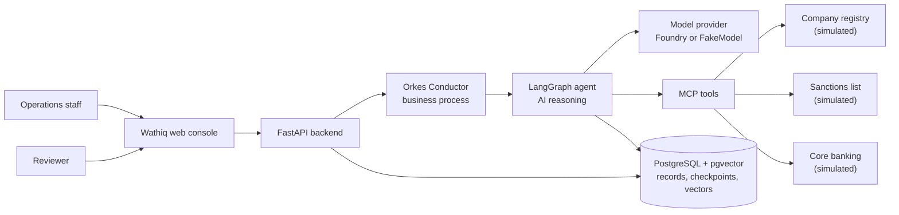
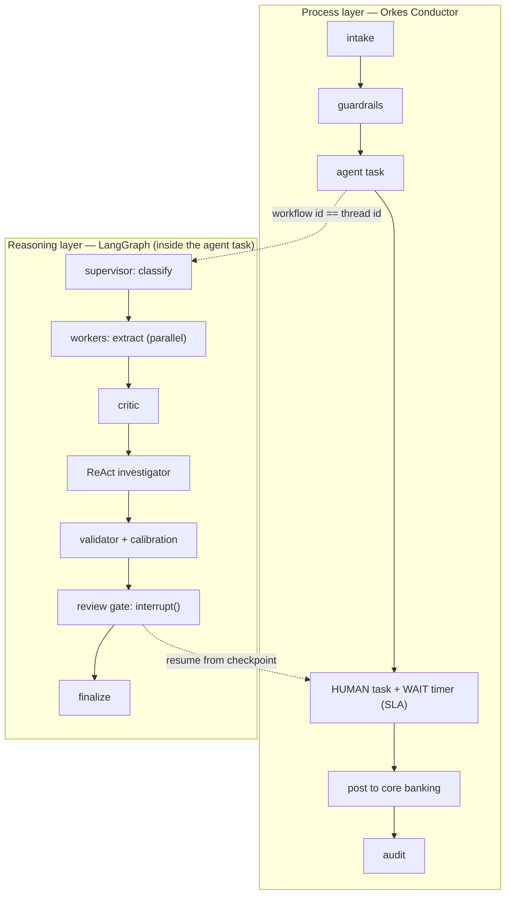
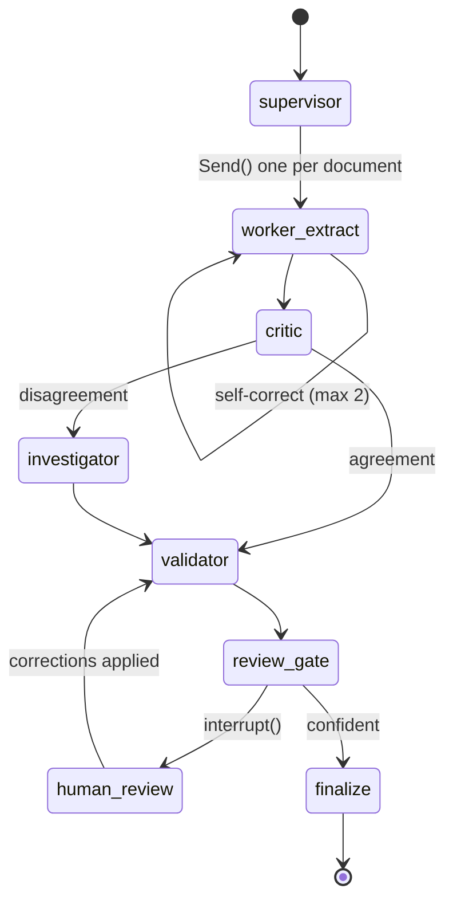
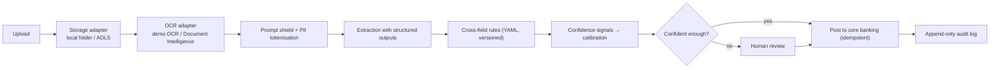
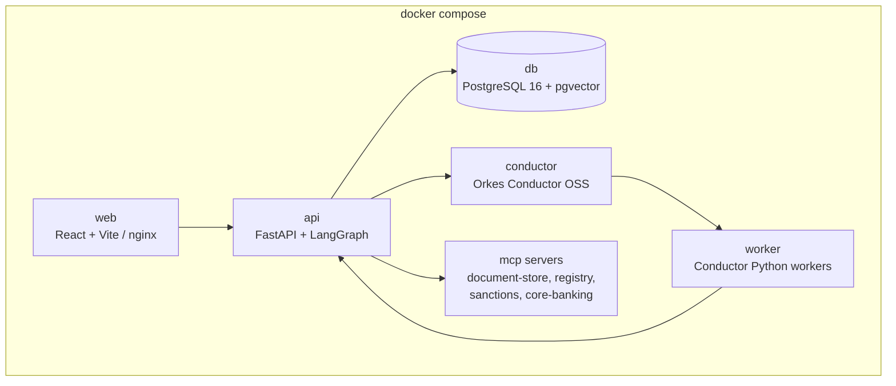

# Architecture

Five pictures, each with a short explanation. The same diagrams are rendered live inside the app on
the **About the system** screen (they come from `GET /api/v1/system/info`).

---

## 1. System at a glance

People only ever talk to the web console. The backend owns the data and starts the process; the
process layer decides *what happens next*; the reasoning layer decides *what the documents say*.
Tools that reach outside the system are MCP servers, so each one has its own contract and its own
permissions.

---

## 2. The two layers

**This is the diagram to start from when explaining the system.**

- Conductor is the *manager*: it knows the order of business steps, how long each may take, who must
  act, and what to do when nobody does (escalate).
- LangGraph is the *thinker*: given the documents, it works out what they say and how sure it is.
- They meet at one identifier. `case.thread_id` is both the Conductor workflow ID and the LangGraph
  thread ID, so a single search finds the business history *and* the reasoning history.

---

## 3. The agent graph

| Node | Pattern | What it does |
|---|---|---|
| `supervisor` | supervisor-worker | Classifies each document and fans work out with the Send API — documents are processed in parallel, not one after another. |
| `worker_extract` | self-reflection | Extracts fields as structured output. If Pydantic validation fails, it sees the error and tries again, at most twice, then gives up honestly. |
| `critic` | actor-critic | A second opinion that challenges values not supported by the quoted source text. Disagreement is a signal, not a failure. |
| `investigator` | ReAct | Reason → act → observe, using MCP tools, to resolve a mismatch between documents. Has a strict step budget. |
| `validator` | rules | Applies versioned cross-field rules from YAML, then calibrates confidence. |
| `review_gate` | HITL | Calls `interrupt()` at mandatory points (possible sanctions match, expired document, first cases of a new type) and dynamic points (low confidence on a critical field, critic disagreement, suspected injection). |
| `finalize` | — | Writes results and hands control back to Conductor. |

**The rule that matters:** nodes before `interrupt()` must have no side effects, because the node
re-runs when the graph resumes. Anything that writes goes *after* the gate.

---

## 4. What happens to a document

Confidence is not the model's self-reported number alone. It is built from signals — OCR confidence,
whether the value is grounded in the source text, whether validation rules passed, whether the critic
agreed — and then **calibrated** against the golden set, so a stated 90% matches an observed 90%.

---

## 5. Containers

Every service has a multi-stage Dockerfile, runs as a non-root user and has a healthcheck. Heavy
services (`conductor`, `e2e`, `mlflow`) sit behind Compose profiles so the core demo starts on a
laptop. In Azure the same images run on AKS from Azure Container Registry, deployed with Helm.

---

## Data model in one paragraph
A **case** belongs to a customer and has **documents**; each document produces **extracted fields**
(value, confidence, calibrated confidence, page, bounding box, source snippet, critical flag).
Rules produce **findings** (severity, description, policy citation). When a human is needed, a
**review task** is created with a reason code and an SLA. Every action — by a person, an agent or the
system — appends one row to **events**, which is never updated or deleted: the case timeline and the
audit log are two reads of that one table. Configuration lives in **document types** (field schema +
rules) and **prompts** (semantic versions with draft / approved / retired status).
